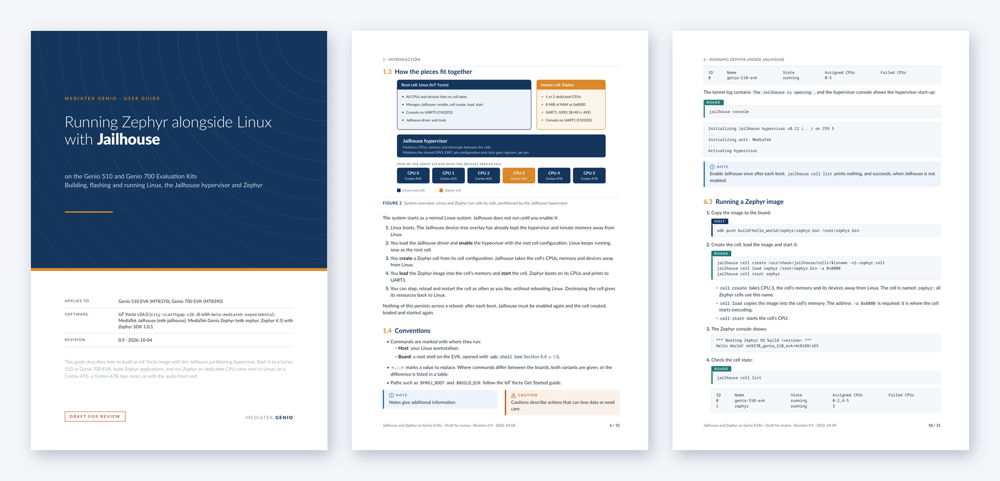

# MediaTek Genio documentation

Documentation for running Zephyr on MediaTek Genio EVKs, next to Linux, with
the Jailhouse partitioning hypervisor.

<a href="https://github.com/mtk-zephyr/genio-docs/releases/latest/download/genio-jailhouse-zephyr-guide.pdf"></a>

## User guide

**Running Zephyr alongside Linux with Jailhouse on Genio 510 and Genio 700 EVKs**

How to build an IoT Yocto image with Jailhouse, flash it, build Zephyr and the
Genio samples, and run Zephyr in a Jailhouse cell: on a Cortex-A55, a
Cortex-A78, two cores, or with the audio front end.

- **PDF, latest release:** [genio-jailhouse-zephyr-guide.pdf](https://github.com/mtk-zephyr/genio-docs/releases/latest/download/genio-jailhouse-zephyr-guide.pdf)
- **All releases:** [Releases](https://github.com/mtk-zephyr/genio-docs/releases)
- **Source:** [`guide/genio-jailhouse-zephyr-guide.md`](guide/genio-jailhouse-zephyr-guide.md)
- **Boards:** Genio 510 EVK (MT8370), Genio 700 EVK (MT8390)

## Repository layout

| Path | Content |
|---|---|
| `guide/` | The user guide, in Markdown |
| `tools/` | The PDF build (see [`tools/README.md`](tools/README.md)) |
| `assets/` | Images for this README |
| `.github/workflows/guide.yml` | Builds the PDF for every change, and publishes it with each release |

## Releases

The PDF is built by the workflow, not committed. Every push and pull request
builds it, and the PDF is attached to the run as an artifact for review. To
publish a revision, tag it:

```bash
git tag v1.0
git push origin v1.0
```

The workflow then creates the release `v1.0` with the PDF attached. A tag
with a suffix, such as `v1.1-rc1`, becomes a pre-release. The link above
always points to the latest full release.

Keep the revision history at the end of the guide in step with the tags.

## License

Copyright (c) 2026 MediaTek Inc.

- The documentation (`guide/`, `assets/`) is licensed under the
  [Creative Commons Attribution 4.0 International License](LICENSE) (CC BY 4.0).
- The tools (`tools/`, `.github/`) are licensed under the
  [Apache License 2.0](tools/LICENSE).

## Related

- [Genio Zephyr tree](https://github.com/mtk-zephyr/mtk-zephyr)
- [Genio Zephyr samples](https://github.com/mtk-zephyr/samples)
- [MediaTek Jailhouse](https://github.com/mtk-jailhouse/jailhouse)
- [IoT Yocto documentation](https://genio.mediatek.com/doc/iot-yocto/latest/sw/yocto/get-started.html)
